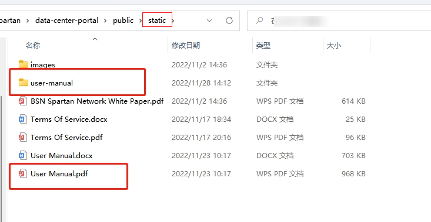
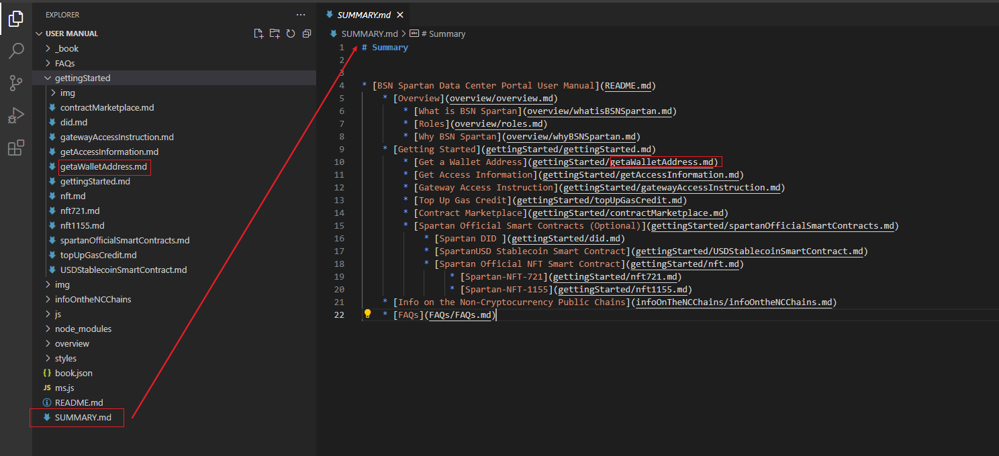
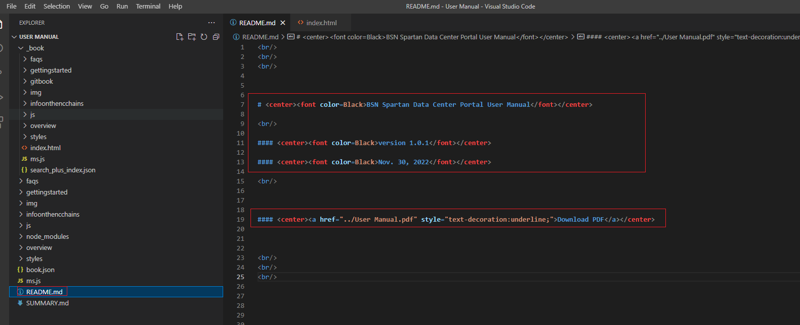
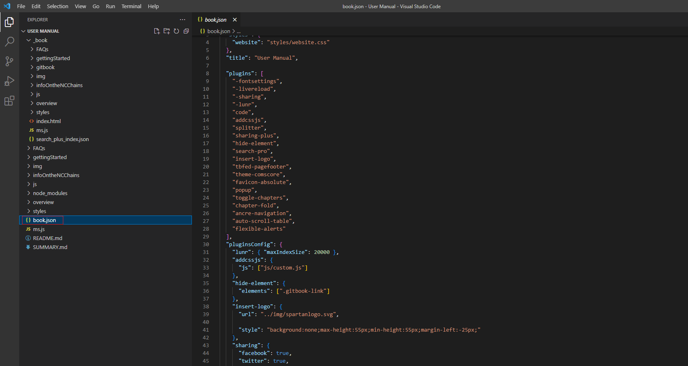
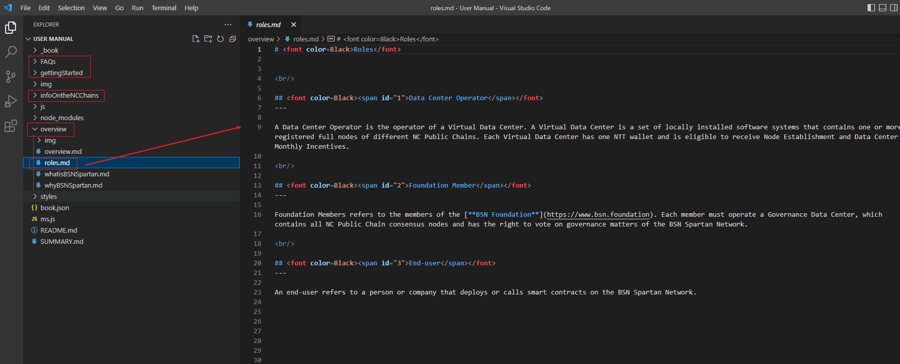
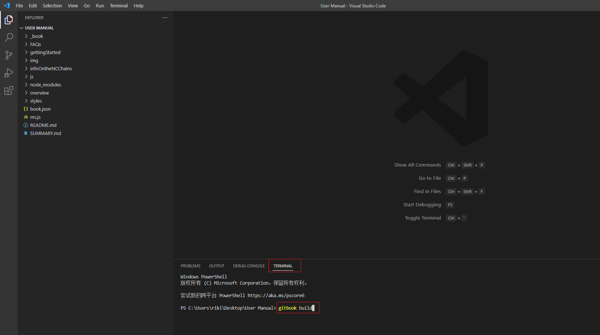
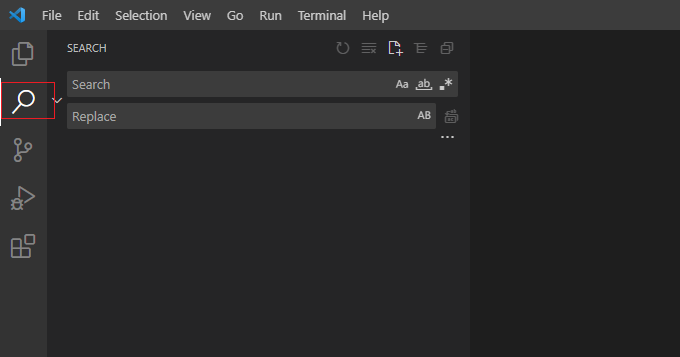

# Data Center Portal System Deployment Manual
------


## Introduction
------

This document is a guide to the installation, configuration and operation of the BSN Spartan Network Data Center Portal System. This system connects to the [Data Center Management System v1.2.0](https://github.com/BSN-Spartan/Data-Center-System/blob/main/Data%20Center%20System%20Upgrade%20Manual.md) and later version.

## Hardware Requirements
------

Minimum Requirements:
- 1 CPU
- Memory: 2GB

Recommended Requirements:
- 2 CPU
- Memory: 4GB

## System Installation
------

### 1. Prerequisites

| Software  | Version  |
| ----- | ----- |
| Node.js | 14+ |
| git | 2.39.0+ |
| [Spartan-I Chain Default Node](https://github.com/BSN-Spartan/NC-Ethereum) | - |
| [Data Center Management System](https://github.com/BSN-Spartan/Data-Center-System) |1.1.0+|
| [Data Center Gateway](https://github.com/BSN-Spartan/Data-Center-Gateway) (recommended) | - |
| PM2 (optional) | latest |

Note: Data Center Gateway is provided by the Data Center Operator to its end-users for accessing the Spartan Network. It can protect the node access, and regulates the transaction amount of end-users. We strongly recommend that the Data Center Operator should set up the Data Center Gateway before installing the portal system.

### 2. Download the Data Center Portal Deployment Package

Download the data center portal deployment package to a local directory:

```
git clone https://github.com/BSN-Spartan/Data-Center-Portal.git
```


### 3. Configure the Data Center Portal and Management System

#### 3.1 Configure the Port Number of Data Center Portal

Configure the port number in `Data-Center-Portal/package.json` file:

```
"scripts": {
    "start": "next start -p 3000"
  },
```

#### 3.2 Configure the URL of Data Center Management System

Configure the URL in `Data-Center-Portal/next.config.js` file:

```
const baseURL = "data_center_url";
```

Example: http://10.0.51.134:8000

*Note: After changing the port number of Data Center Portal or the URL of Data Center Management System, you must run the command below to rebuild the project.*

Rebuild the project:
```
npm run build
```

#### 3.3 Portal Management

The logo and other information of the portal can be set in the Data Center Management System.

Please refer to [Portal Management](https://spartan.bsn.foundation/static/quick-start/2gettingStarted/2-1-2.html) section to configure the information of the portal.


### 4. Start the Data Center Portal System

Go to the directory where the deployment package is located

#### 4.1 Install Dependencies

```
npm install
```

#### 4.2 Start/Stop the Project

##### 4.2.1 Start the Project

```
npm run build
npm run start
```

##### 4.2.2 Stop the Project

```
 ctrl+C
```

#### 4.3 Permanent Start/Stop the Project

##### 4.3.1 PM2 Management Tool
Install PM2:

```
npm install pm2@latest -g
```
Check whether PM2 is successfully installed:

```
pm2 -v
```

Please be noted that PM2 is not a must, it's a node application management tool that we recommended, you can use whatever you like.

##### 4.3.2 Permanent Start

```
npm run build
pm2 start server.js
```

##### 4.3.3 Permanent Stop

```
pm2 stop server.js
```

### 5. User Manual Deployment

After deployed the portal, you need to customize the default user manual to meet the actual business requirements.

We have provided the user manual in both word and markdown formats, which can be obtained through `Data-Center-Portal/public/static/` directory.

When using the user manual in markdown format, please ensure that you have installed gitbook locally. Here we take Windows system as an example to introduce how to install and use it:

1. Download and install Node.js from [Official Website](https://nodejs.org/download/release/v10.12.0/), you need to use a lower version of Node.js (for example v12.12.0) to install gitbook.

2. Open command prompt and check the version：
   `node -v`
   v12.12.0
   `npm -v`
   6.11.3

3. Install gitbook by command prompt：
   `npm install gitbook-cli -g`
   Run command below to check the version：
   `gitbook --version`
      CLI version: 2.3.2
      GitBook version: 3.2.3

4. Create a folder and run command below to check whether gitbook has been successfully installed:
    `gitbook init`

    If installed, the following message will be returned:
    ```
    warn: no summary file in this book
    info: create README.md
    info: create SUMMARY.md
    info: initialization is finished
    ```
5. Copy the user manual in word format and `user-manual` folder to this folder. The user manual in markdown format is saved in in `user-manual` folder.

    


    You can edit the word document and then export it to the pdf version and store that file in the same path.

    Please keep the name consistent among different user manual formats.

6. Edit markdown documents. You can open `user-manual` folder through Visual Studio Code to edit the markdown document.

- Click SUMMARY.md to change the directory. Please note that the directory structure is consistent with the word document.

  

- Click README.md, edit the name, version and revision date of the user manual. If you do not need to provide the pdf version, you can delete the last row of data.

  

- Configure the logo and copyright information of your online user manual in book.json.

  

- The default user manual creates folders according to chapters. The contents of each chapter are stored in the corresponding folder as markdown documents. You can edit them directly.

  

- After editing the markdown documents, you can check the user manual by typing `gitbook serve` command to generate html file. You can also directly type `gitbook build` command to generate the user manual in the terminal, and the generated manual will be stored in `_ Book` folder. After saving the file, press `Ctrl+C` to terminate the command.

  

- Enable global search, replace `<a href="./">` with `<a href="./index. html">`, replace`< A href="../">` with `<a href="../index. html">`.
Then, find `index.html file` in `_book` folder and replace `../` with `./`.

  

- After the above operations are completed, replace the files in the `Data-Center-Portal/public/static/user-manual` folder in the server with the files in `_book` folder.
