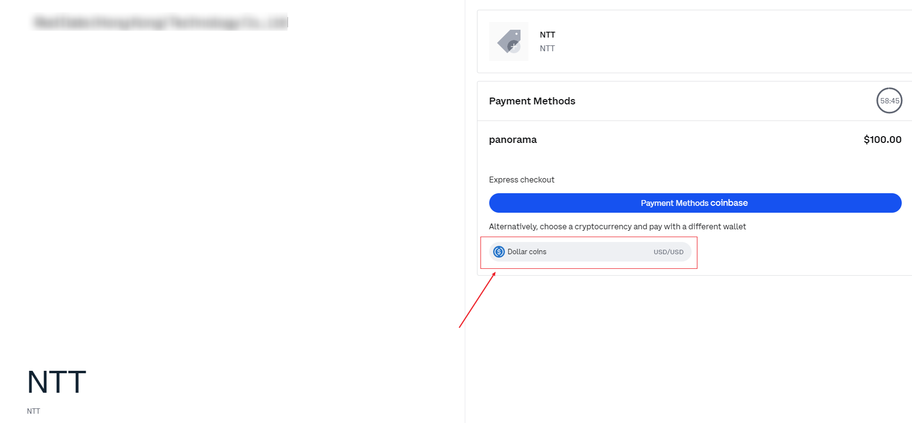

# Top Up Gas Credit

 
Any Wallet in the Non-Cryptocurrency Public Chains must consume Gas Credit when initiating a transaction. For example, if a user wants to initiate a transaction, the user’s Wallet needs to consume Gas Credit. At this time, users must use fiat currency or USDC to top up the Gas Credit of the Wallet to ensure that the transaction can proceed normally. 

 

## Operation Steps
---

**Visit BSN Spartan Data Center Portal and click "Top Up Gas Credit":**

- Select a chain, enter your wallet address and confirm it. Then, enter the amount of Gas Credit you would like to top up. Enter an email address and verify it by entering the verification code. The next step is to choose the payment method. BSN Spartan Network Data Center Portal supports 3 methods: Remittance, Stripe or Coinbase (pay in USDC);

- Click the **"Confirm"** button, the system will generate an order number and jump to the payment platform you selected. Complete the payment on the pop-up window;

**Pay by Remittance:**

We will send you an email with the payment information.

**Pay by Stripe:**

As shown in the above figure, confirm the invoice and enter your card information. After the payment is completed, you will receive a notification by email.

> [!Note|style:flat]

> - *When paying with Stripe, you cannot exceed $999,999.99 in a single transaction.*

**Pay by Coinbase:**

You can make the payment in USDC. After the payment is successful, you will receive a notification by email.

> [!danger|style:flat]

> - *All payments above are made by the third-party payment platform, and the Spartan Network Data Center Portal will never obtain your account information.*

 

## Check the email of Submitted Order
---

Users will receive an email notification when the order is submitted. You may also complete the payment via the link in the email.

 

## Check the email of Successful Payment
---

Users will receive an email notification when the payment succeeds.

 

## Check the email of Successful Top-up
---

Users will receive an email notification when the Gas Credit top-up succeeds. Users can check the Gas Credit information through the link in the email.

 

## Check the Currency or USDC Refund (If Top-up Failed)
---

Please make sure the Currency or USDC is correctly refunded.

 
 
 