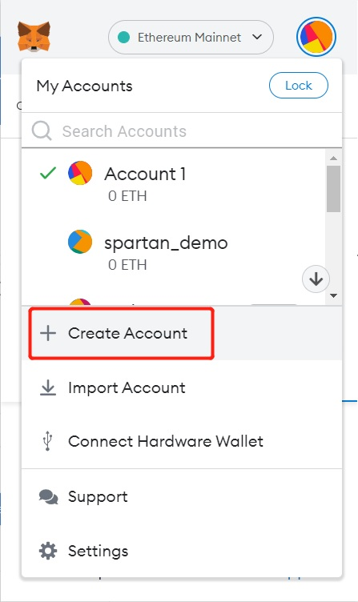

# Get a Wallet Address

 

## An Existing secp256k1 Wallet Address
---

If you already have a private key generated by the secp256k1 algorithm and its corresponding wallet address, such as an Ethereum wallet address, you can use that wallet address directly.

 

## Using MetaMask
---

You can download MetaMask [**here**](https://metamask.io/download/) and create an account for free.

The account address in MetaMask can be used as a Wallet Address, and the corresponding private key is the same.

 
 
 